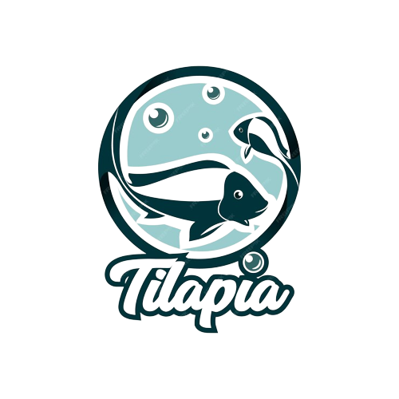

<!-- Improved compatibility of back to top link: See: https://github.com/othneildrew/Best-README-Template/pull/73 -->
<a name="readme-top"></a>
<!--
*** Thanks for checking out the Best-README-Template. If you have a suggestion
*** that would make this better, please fork the repo and create a pull request
*** or simply open an issue with the tag "enhancement".
*** Don't forget to give the project a star!
*** Thanks again! Now go create something AMAZING! :D
-->


<!-- PROJECT SHIELDS -->
<!--
*** I'm using markdown "reference style" links for readability.
*** Reference links are enclosed in brackets [ ] instead of parentheses ( ).
*** See the bottom of this document for the declaration of the reference variables
*** for contributors-url, forks-url, etc. This is an optional, concise syntax you may use.
*** https://www.markdownguide.org/basic-syntax/#reference-style-links
-->

<!-- PROJECT LOGO -->
<br />
<div align="center">
  <a href="https://github.com/DiogoM-Almeida/Projeto-Tilapiacultura">
    
  </a>

<h3 align="center">Projeto Tilapiacultura</h3>

  <p align="center">
    Projeto desenvolvido na disciplina de Implementação de Sistemas de Informação - UNESP - Bauru
  </p>
</div>


<!-- TABLE OF CONTENTS -->
<details>
  <summary>Indice</summary>
  <ol>
    <li>
      <a href="#sobre-o-projeto">Sobre o Projeto</a>
      <ul>
        <li><a href="#built-with">Construido Com:</a></li>
      </ul>
    </li>
    <li>
      <a href="#getting-started">Instalando</a>
      <ul>
        <li><a href="#executavel">Instalando o executavel</a></li>
        <li><a href="#dev">Instalação para Desenvolvimento</a></li>
        <ul>
          <li><a href="#prerequisites">Pre-requisitos</a></li>
          <li><a href="#installation">Intsalação</a></li>
        </ul>
      </ul>
    </li>
  </ol>
</details>


<!-- ABOUT THE PROJECT -->
## Sobre o Projeto

Projeto feito para criar um sistema de gestão para criação de tilapias

<p align="right">(<a href="#readme-top">back to top</a>)</p>


### Construido com:
[](https://www.python.org/)
[](https://docs.python.org/3/library/tkinter.html)
[](https://www.mysql.com/)
[](https://www.reportlab.com/)

<p align="right">(<a href="#readme-top">back to top</a>)</p>


<!-- GETTING STARTED -->
## Instalando

Você pode instalar o executavel do projeto, ou direto da fonte.

### Instalando o Executavel

Você pode baixar o main.zip nas releases e descompactar, depois é só executar.

### Instalando da Fonte

#### Pre-requisitos

Você deve ter python 3.11 instalado.

### Instalação

1. Clone o repositorio
   ```sh
   git clone https://github.com/DiogoM-Almeida/Projeto-Tilapiacultura.git
   ```
2. Entre na pasta e crie o ambiente virtual
   ```sh
   cd Projeto-Tilapiacultura
   python -m venv venv
   ```
3. Intale as bibliotecas necessarias
   ```sh
   pip install mysql-connector-python reportlab
   ```
4. Execute o main.py
   ```sh
   python main.py
   ```

<p align="right">(<a href="#readme-top">back to top</a>)</p>
